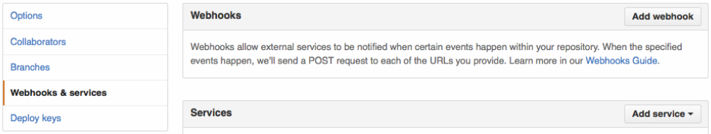
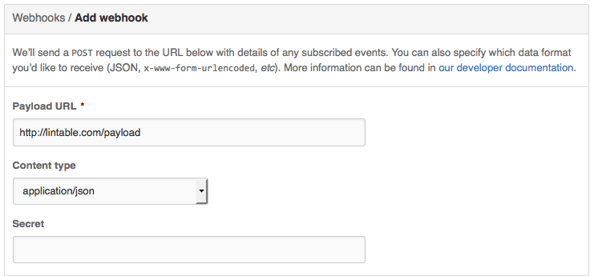
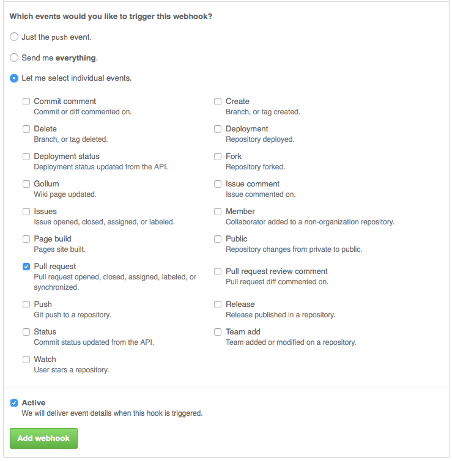
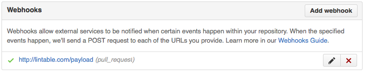

# CapstoneTeamG

## Getting set up for development

Lintball has several pre-requisites that will need to be installed first.
* Ensure you have postgresql development headers installed.
* Ensure you have a working C++ build environment.
* _(For development purposes you may wish to have redis and rabbitmq as well.)_

Lintball uses Python's type hinting available in python 3.5 and newer.

* On Ubuntu Linux:
    * Python 3.5 does not currently come from apt by default. It is available from other sources such as [deadsnakes](https://launchpad.net/~fkrull/+archive/ubuntu/deadsnakes).
    * Run `apt-get install python3.5 python3.5-dev python3-pip`.
* On OS X, install [Homebrew](http://brew.sh), then `brew install python3`.
* On Windows, install [Chocolately](https://chocolatey.org), then `choco install python3`. Beware of possible executable name conflicts with python2, as noted on the [package description](https://chocolatey.org/packages/python3). By default the executable to use for the instructions below is is `pip.exe` and not `pip3.exe`.

Once `python3` and `pip3` are ready, run `pip3 install virtualenv`.

Once Python, pip, and virtualenv are ready, in the the `CapstoneTeamG` folder, run `virtualenv venv --python=python3.5`. This will create a `venv` subfolder to contain Python binaries, installed dependencies, etc.

Before you run any scripts in/on the project folder, you should run in the same terminal:

* bash/zsh: `source venv/bin/activate`
* csh: `source venv/bin/activate.csh`
* fish: `source venv/bin/activate.fish`
* Windows: `venv\Scripts\activate`

For initial setup, run the following. (Running `python` instead of `pip` directly here avoids some errors that can be caused by spaces in file paths.)

```shell
python venv/bin/pip install pip-tools
python venv/bin/pip install -r requirements.txt --allow-all-external
```

## Changing project requirements

After any changes to `requirements.in`, run the activate script as noted in the [README](README.md), then:

```shell
pip-compile requirements.in
pip install -r requirements.txt --allow-all-external
```

## Development environments

* **Atom:** Install the [editorconfig package](https://atom.io/packages/editorconfig).
* **PyCharm:** Agree to the notification that pops up about EditorConfig settings.

## Adding a webhook to a GitHub repository

Here are step by step instructions for adding a webhook to your GitHub repository. Once the webhook is established, [lintable.com](http://lintable.com/) will automatically run on a new pull request.

**Step 1**
Go to the Settings page of your repository, and click on Webhooks & services. After that, click on Add webhook.



**Step 2**
Enter the correct server endpoint for [lintable.com](http://lintable.com/) in the "Payload URL" field. Leave the default "Content type" as "application/json" and the "Secret" blank.



**Step 3**
On the events dialog box, select "Let me select individual events" and then select "Pull Requests" as the only event for the webhook. Check "Active" and then click on the **Add Webhook** button to create the webhook.



**Step 4**
The settings page should now display and active webhook for [lintable.com](http://lintable.com/).



For more information on webhooks, see the [GitHub documentation](https://developer.github.com/webhooks/).
